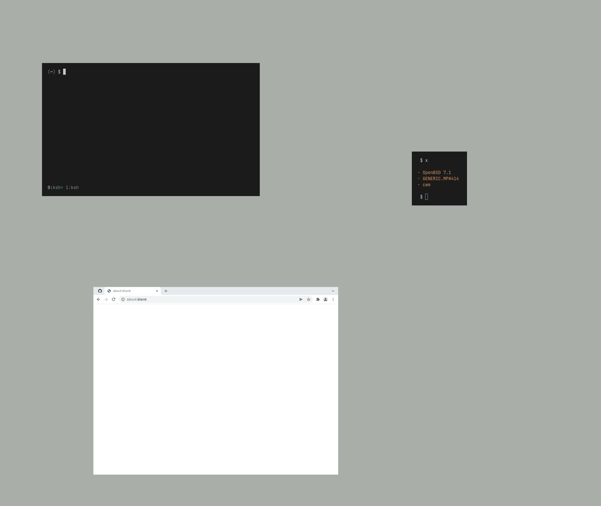

dotfiles
========

personal dotfiles/configuration files

structure
---------
::

	~/                              # ahh, there's no place like $HOME
	~/bin/                          # personal scripts: https://github.com/e-zk/bin
	~/etc/                          # various configuration files, also set as XDG_CONFIG_HOME
	~/opt/                          # misc. (not in repo)
	~/usr/                          # documents, images, etc (not in repo)
	~/var/                          # temp files, pid files, XDG_CACHE_HOME (not in repo)

programs
--------
::

	terminal                        # xterm
	shell                           # ksh
	editor                          # vis
	bar(s)                          # lemonbar-xft
	compositor                      # picom
	window manager                  # cwm
	notifications                   # notif + notified (custom scripts)

